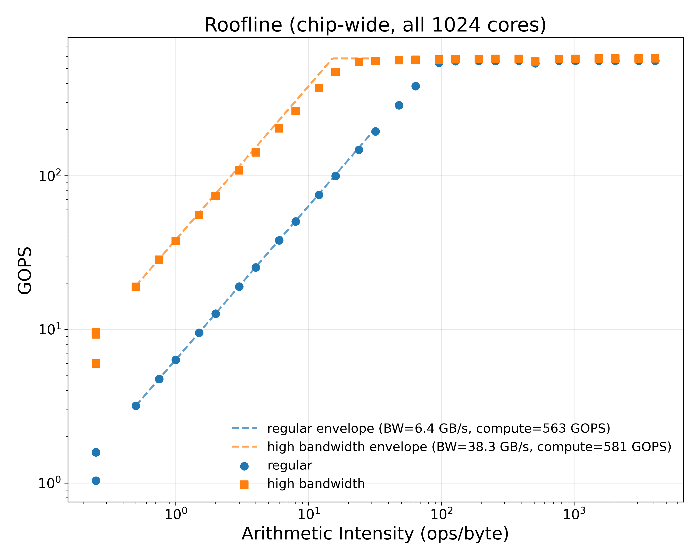
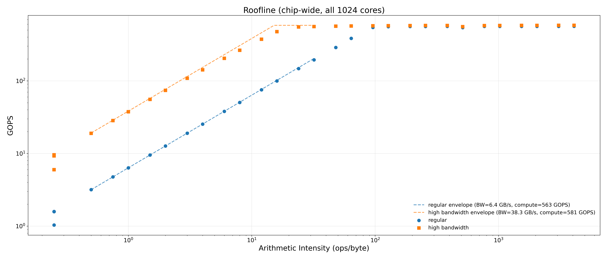
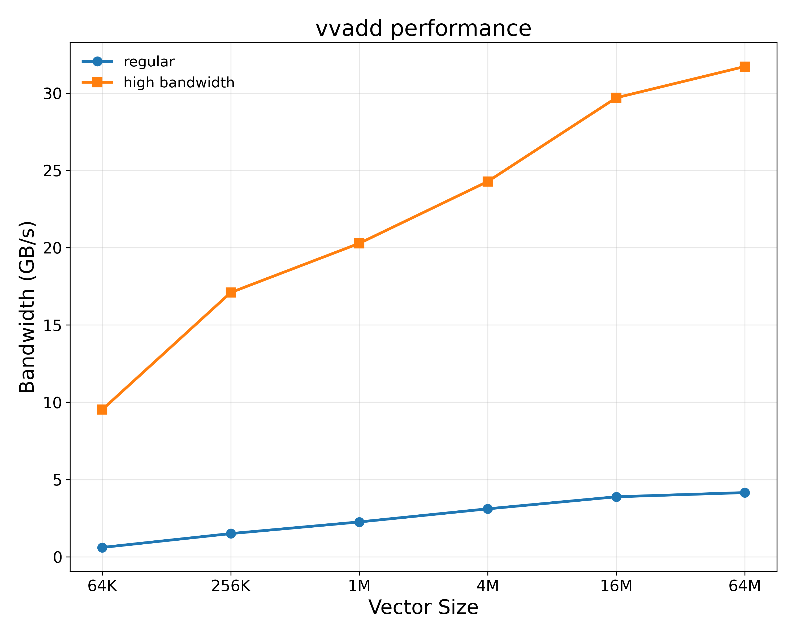
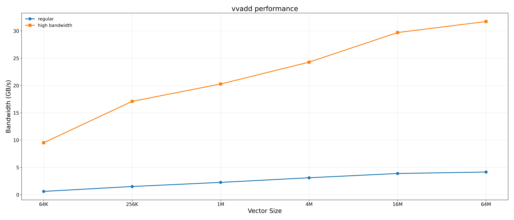
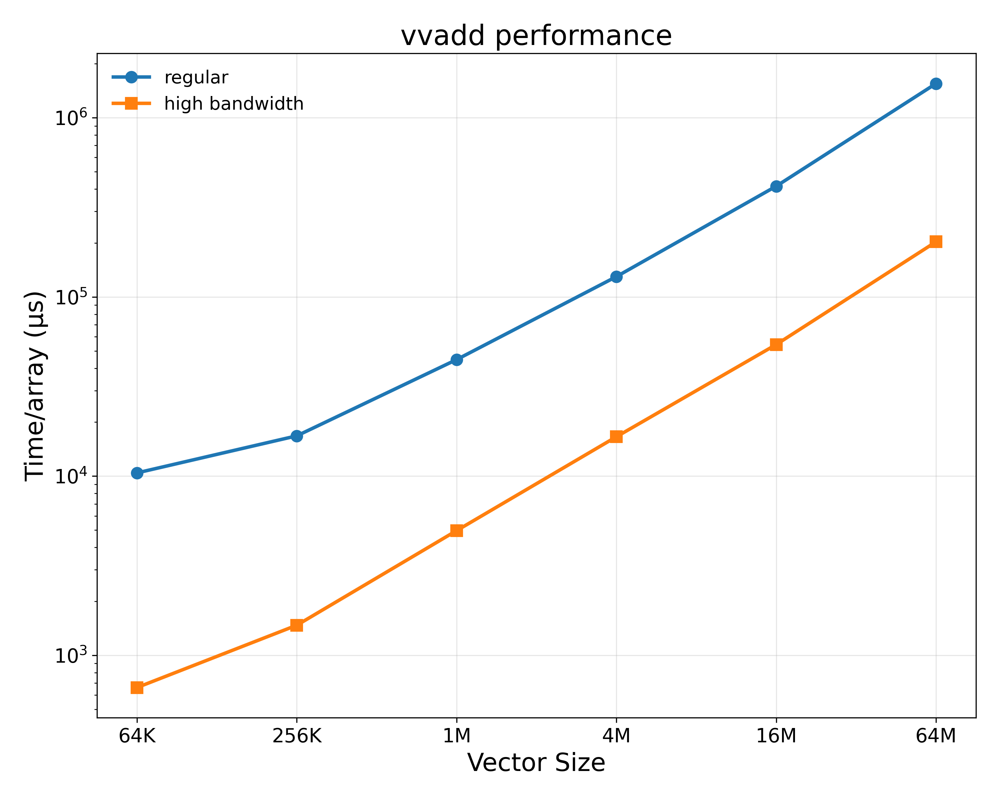
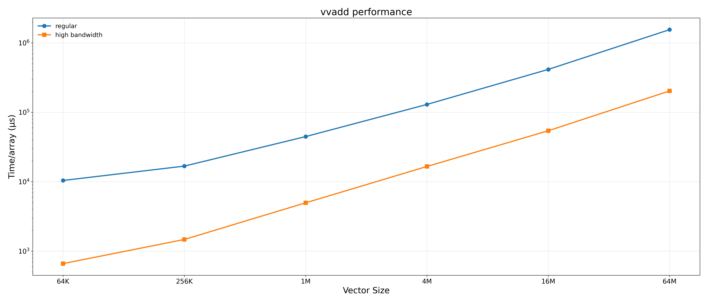

# Microbenchmark charts

Diagnostic kernels: roofline (compute/BW envelope) and vvadd (memory
bandwidth probe).  Same conventions as `smithwaterman.md`: 10×8 inches
default (21×9 wide variant), 300 dpi.  Regular vs high-bandwidth use
**blue = regular**, **orange = high bandwidth** consistently.  All
throughput numbers are **chip-wide** — i.e. across all 1024 cores
(8 pods × 128 tiles).  CSV slow values are already ×32 sim32bw-projected
per-pod by `run_experiments.sh`; we apply the ×8 chip-wide multiplier
in the plotter.

## Roofline

`dummy/roofline` sweeps `OPS_PER_ELEM` from 1 → 16384 at fixed
N_ELEMS = 4 M ints.  Bandwidth and GOPS are reported by the kernel
internally (per-pod), then ×8 here for chip-wide.  High-bandwidth
points are slow-clock measurements with the time-scale-down by 32 ×
already applied to throughput.

| Metric | Regular | High bandwidth | Speedup |
|---|---|---|---|
| Peak chip-wide BW | **6.4 GB/s** | **38.3 GB/s** | **6.0×** |
| Peak chip-wide compute | 563 GOPS | 581 GOPS | ~1.0× (expected — projection preserves compute) |
| Ridge AI (BW = compute) | ~89 ops/B | ~15 ops/B | — |

The compute roof is essentially unchanged (the projection only re-times
memory-bound regions); the BW roof rises ~6× and the ridge AI shifts
left, so a much wider band of arithmetic intensities is now compute-
bound rather than BW-bound — exactly the expected story for a faster
memory subsystem.

### `roofline.png` / `roofline_wide.png`

## vvadd

`c[i] = a[i] + b[i]` per element.  Per pod traffic = 12 × N bytes
(2 reads + 1 write × 4 B/int).  Chip-wide bytes = 8 pods × 12 × N
= **96 × N bytes** at the pod-level perspective (one DRAM channel
serves all 8 pods, so this is the aggregate the chip *requests*; what
the DRAM controller serves uniquely depends on caching).

| Metric | Regular | High bandwidth | Speedup |
|---|---|---|---|
| Peak chip-wide BW (at N = 64 M) | **4.15 GB/s** | **31.7 GB/s** | **7.6×** |

Slow vs fast raw kernel time at N=64M: **6.50 s / 1.55 s = 4.19×**
slow.  Inverse of (32 × 1.55 / 6.50) = **7.6× ratio**, which is the
high-bandwidth speedup over regular at this size.  At smaller N
the speedup is lower (overhead-dominated; the kernel doesn't reach
peak BW).

### `vvadd_bw.png` / `vvadd_bw_wide.png`

Bandwidth ramp with size — both regular and high-bandwidth converge
toward their respective peaks around N ≥ 16 M.

### `vvadd_time.png` / `vvadd_time_wide.png`

Kernel time per array (high-bandwidth shown as the projected slow / 32
time, directly comparable to regular).

