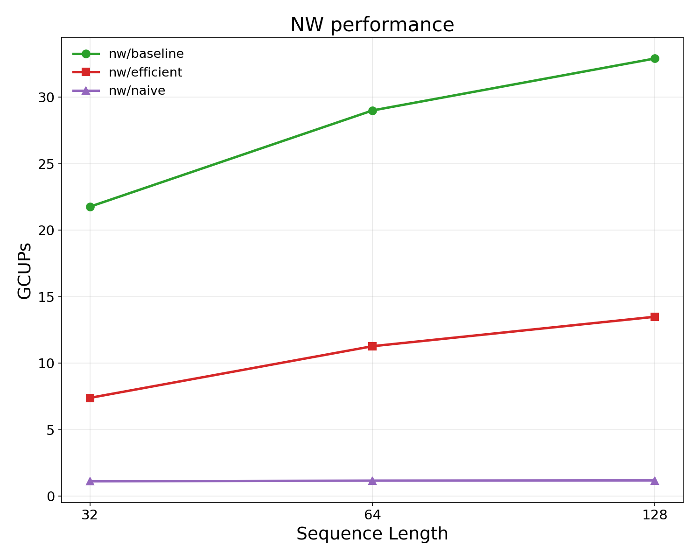
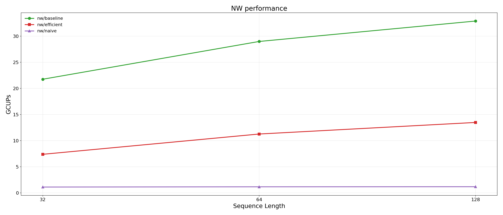
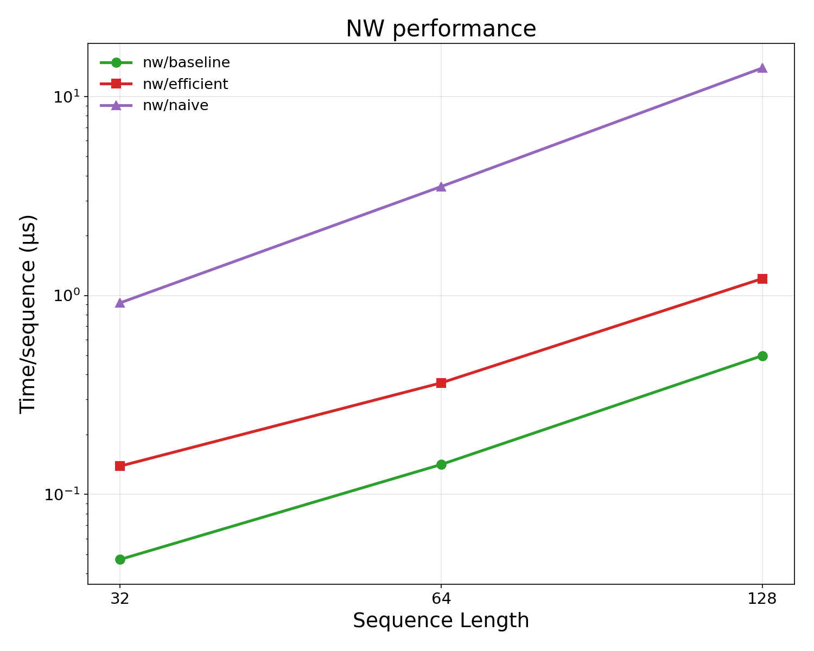
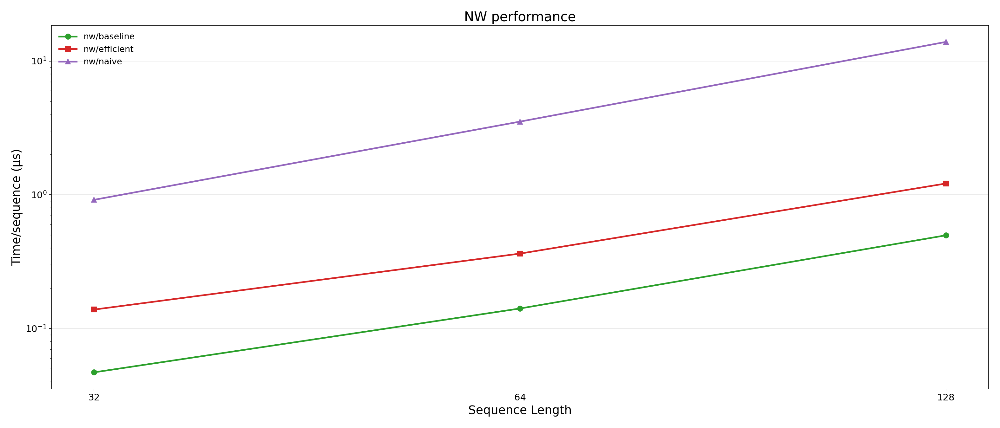

# Needleman-Wunsch charts

Same conventions as `smithwaterman.md`: 10×8 inches default (21×9 wide
variant), 300 dpi.  GCUPs scaled ×8 to reflect the chip (1024 cores).
Time/sequence in microseconds, log scale.  Sequence length on log base 2.

Three implementations:

| App | Notes |
|---|---|
| `nw/baseline` | Row-by-row 1D systolic NW; only writes one int (final score) per sequence to DRAM. |
| `nw/efficient` | Hirschberg divide-and-conquer; produces a path, not just a score.  Per-iter DRAM writes. |
| `nw/naive` | Stores the full O(n²) DP matrix to DRAM per sequence — heavily memory-bound; needed `repeat=10` at seq_len=128 to dodge a hang. |

seq_len=256 was dropped from the launch — `nw/efficient` hangs at that size on HW (out of debugging time).

## Highlights at seq_len=128

Ratios are taken w.r.t. `nw/efficient` (so >1 always reads as "x times
faster" or "x times slower").

| | GCUPs (chip-wide) | Time/sequence | vs nw/efficient |
|---|---|---|---|
| nw/baseline  | 32.9 | 0.50 µs | **2.44× faster** |
| nw/efficient | 13.5 | 1.21 µs | — |
| nw/naive     | 1.18 | 13.9 µs | **11.4× slower** |

Note: nw/efficient does strictly *more* useful work than nw/naive
(it computes the full alignment path, not just a score) and is still
an order of magnitude faster — because nw/naive unconditionally
writes the entire O(n²) DP matrix to DRAM (~66 KB per sequence at
seq_len=128), while nw/efficient uses Hirschberg with O(n) per-iter
DRAM traffic.

## NW — GCUPs

### `nw_gcups.png` / `nw_gcups_wide.png`

## NW — time per sequence

### `nw_time.png` / `nw_time_wide.png`

