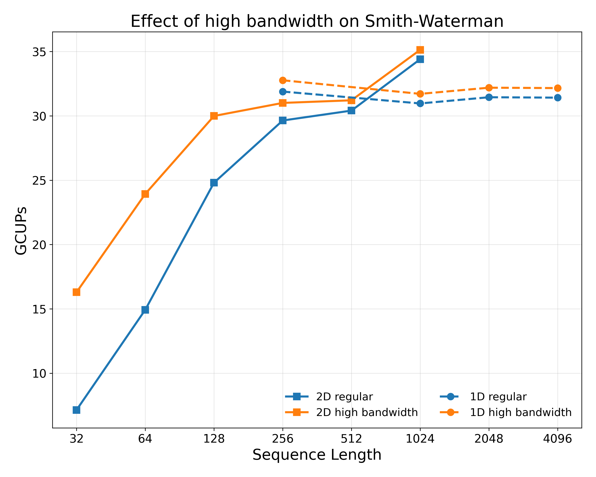
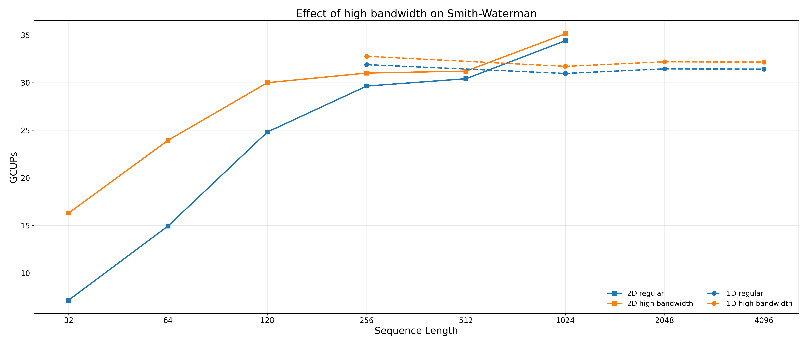

# Smith-Waterman charts

All charts at 300 dpi.  Default size 10×8 inches; 1D plots also export
a 21×9 wide variant for the multi-CPG view.  GCUPs values are scaled
×8 to reflect all 8 pods (chip-wide; 1024 cores total).  Time/sequence
is in microseconds, log-scale.  cpg=2 omitted (most rows timed out at
launch scale; only one passed, not enough to draw a curve).

## 2D systolic array

### `2d_time.png`

### `2d_gcups.png`

## 1D systolic array — best CPG per sequence length

### `1d_best_time.png` / `1d_best_time_wide.png`

### `1d_best_gcups.png` / `1d_best_gcups_wide.png`

## 1D systolic array — all CPG values

Each CPG plotted in its own color.

### `1d_allcpg_time.png` / `1d_allcpg_time_wide.png`

### `1d_allcpg_gcups.png` / `1d_allcpg_gcups_wide.png`

### `1d_allcpg_gcups_max.png` / `1d_allcpg_gcups_max_wide.png`

Same plot with a horizontal dashed line at the peak GCUPs across cpg ≥ 4
— every cpg ≥ 4 hits the same chip-wide peak (~31 GCUPs) at its own seq_len.

## 1D vs 2D — best per sequence length

Common sequence-length range only (sw/2d ceiling = 1024).

### `compare_time.png`

### `compare_gcups.png`

## Effect of high bandwidth — both kernels are compute-bound

Slow-clock measurements scaled ×32 in time (project to a fast clock with
proportionally more DRAM bandwidth) → "high bandwidth".  Encoding:
**color** = regular (blue) vs high bandwidth (orange); **line style +
marker** = 1D (dashed + circle) vs 2D (solid + square).

The take-away: regular and high-bandwidth lines lie nearly on top of
each other for both kernels at every reasonably sized configuration.
That means **neither kernel is meaningfully memory-bound** — the chip
is doing roughly the same number of cell updates per second whether
DRAM is 32× faster or not.

The only visible separation is sw/2d at seq_len ≤ 128, where the
fixed-cost memory phase (kernel-launch / DMA / barrier overhead) is a
big fraction of the (very short) work.  Even there, the gap closes by
seq_len=256 and is gone by seq_len=512.  sw/1d's measured points are
all in the compute-bound regime and the regular/high-bandwidth pairs
are within ~3 % of each other.

### `sw_compare_hibw.png` / `sw_compare_hibw_wide.png`

