# Smith-Waterman charts

All charts at 300 dpi.  Default size 10×8 inches; 1D plots also export
a 21×9 wide variant for the multi-CPG view.  GCUPs values are scaled
×8 to reflect all 8 pods (chip-wide; 1024 cores total).  Time/sequence
is in microseconds, log-scale.  cpg=2 omitted (most rows timed out at
launch scale; only one passed, not enough to draw a curve).

## 2D systolic array

### `2d_time.png`
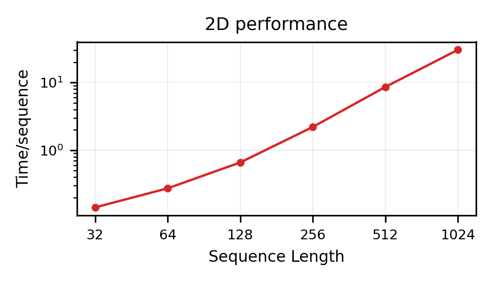

### `2d_gcups.png`
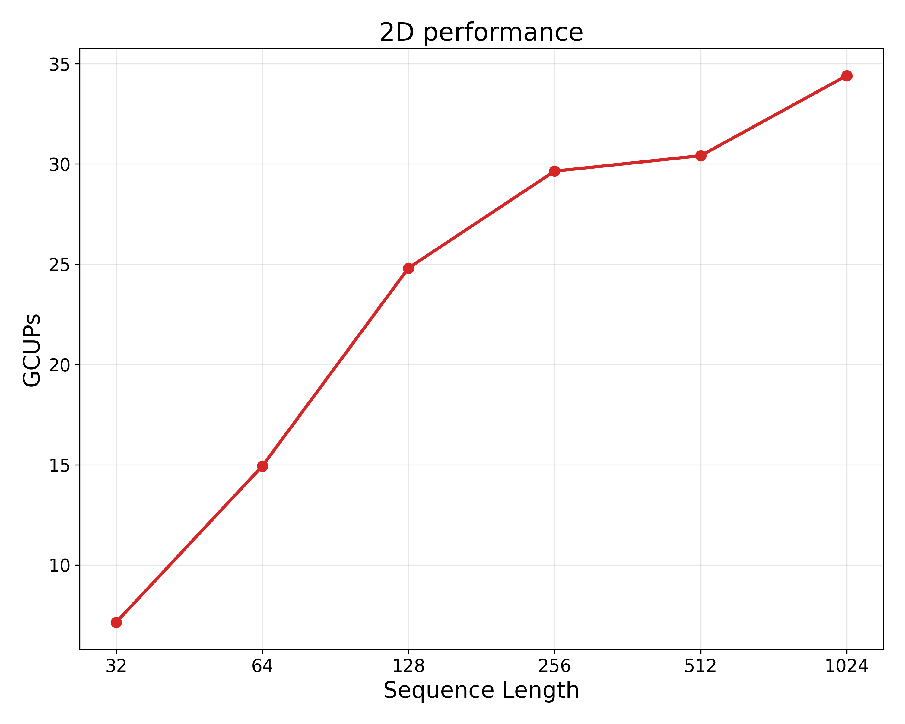

## 1D systolic array — best CPG per sequence length

### `1d_best_time.png` / `1d_best_time_wide.png`
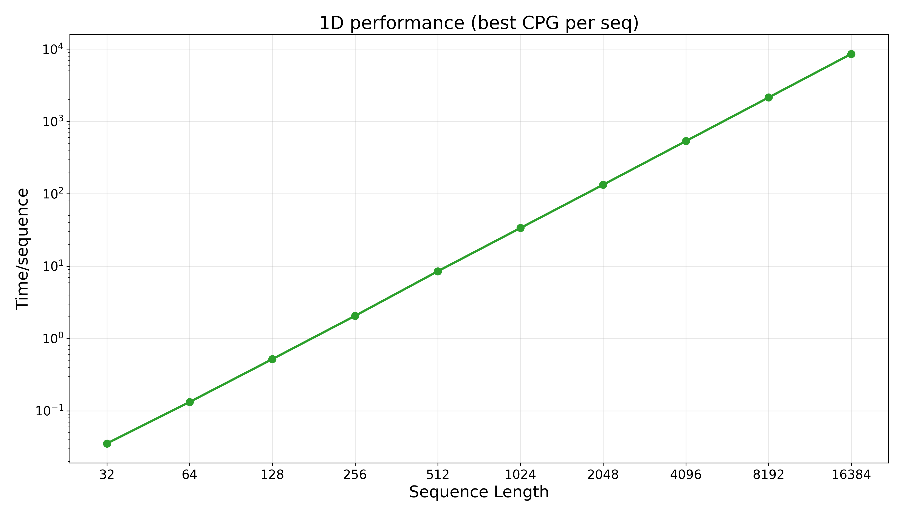
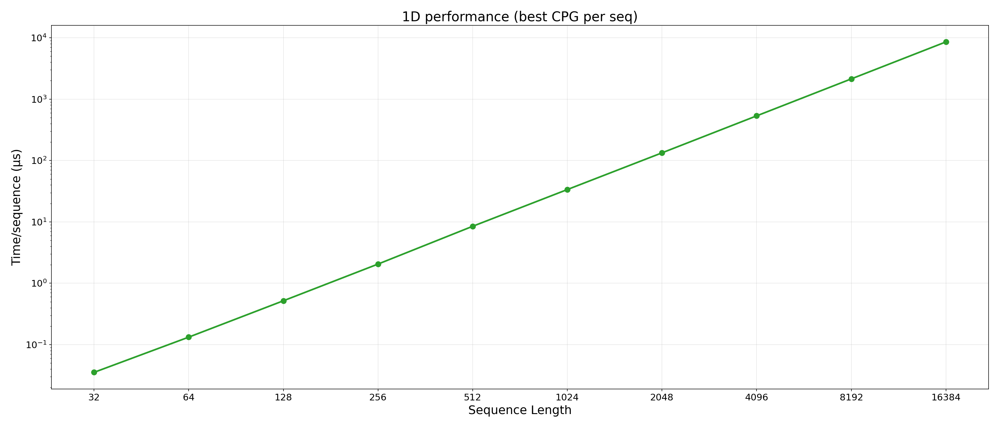

### `1d_best_gcups.png` / `1d_best_gcups_wide.png`
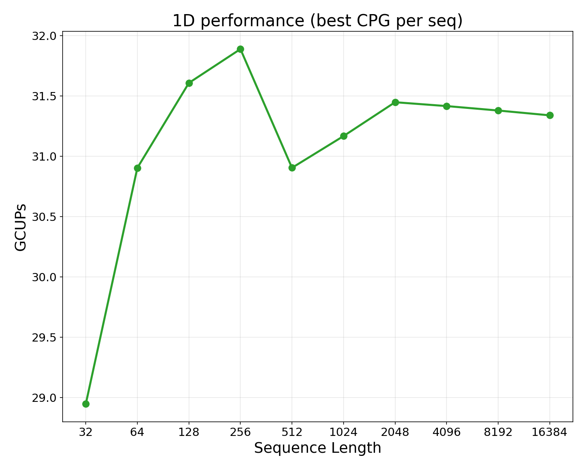
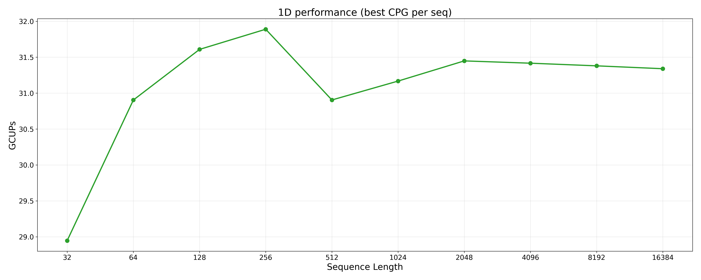

## 1D systolic array — all CPG values

Each CPG plotted in its own color.

### `1d_allcpg_time.png` / `1d_allcpg_time_wide.png`
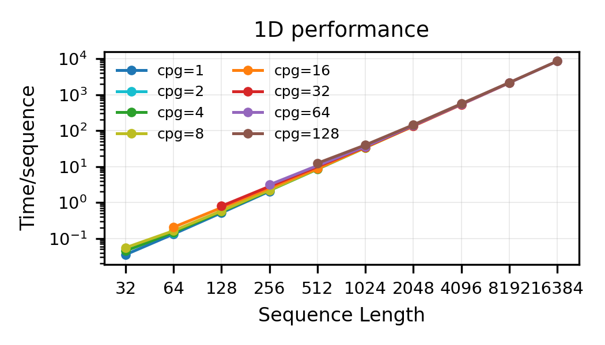
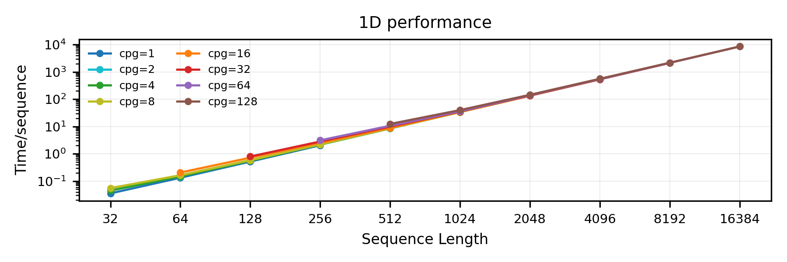

### `1d_allcpg_gcups.png` / `1d_allcpg_gcups_wide.png`
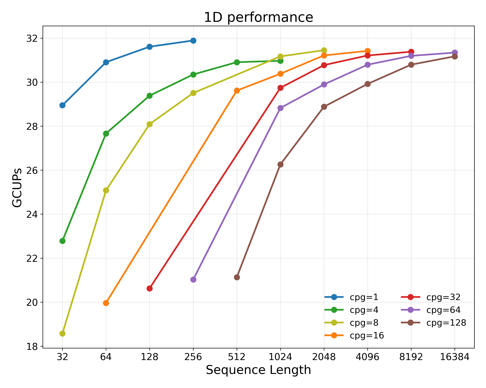
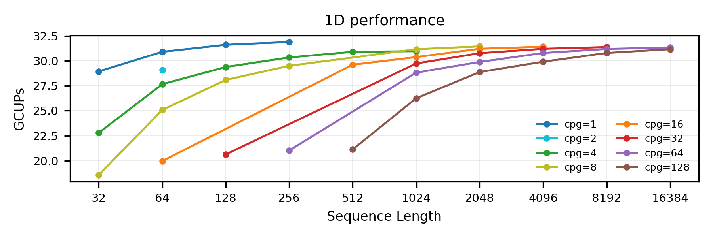

### `1d_allcpg_gcups_max.png` / `1d_allcpg_gcups_max_wide.png`

Same plot with a horizontal dashed line at the peak GCUPs across cpg ≥ 4
— every cpg ≥ 4 hits the same chip-wide peak (~31 GCUPs) at its own seq_len.

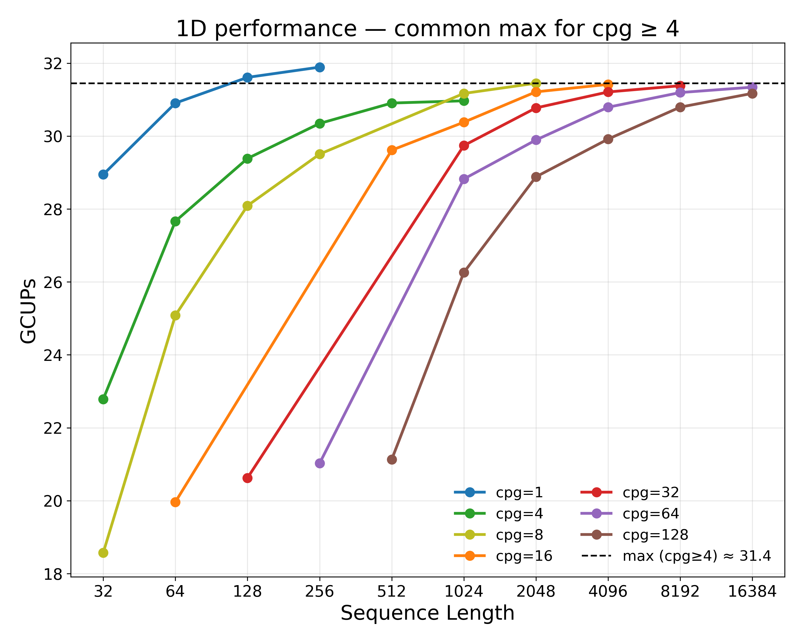
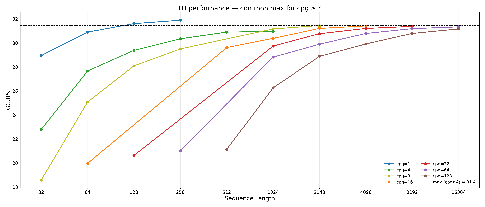

## 1D vs 2D — best per sequence length

Common sequence-length range only (sw/2d ceiling = 1024).

### `compare_time.png`
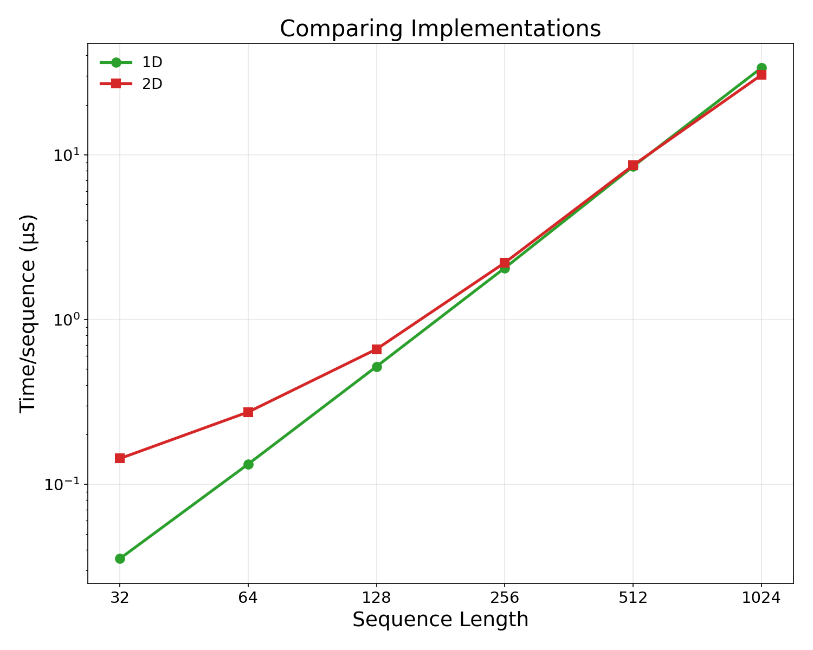

### `compare_gcups.png`
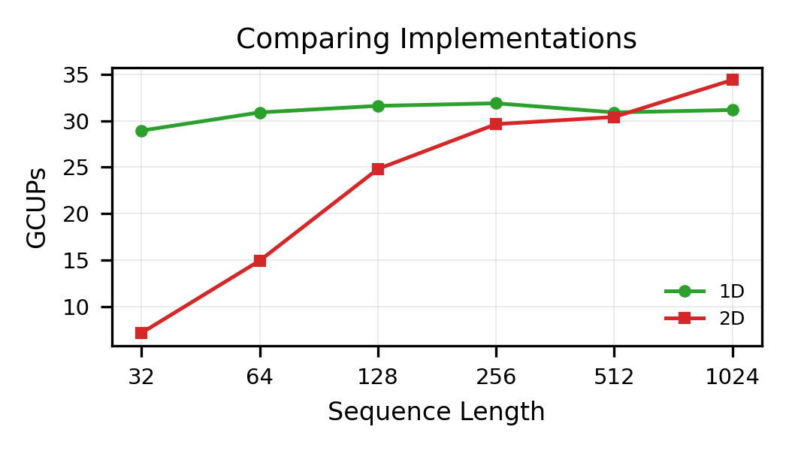

## Effect of high bandwidth

Slow-clock measurements scaled ×32 in time (project to a fast clock with
proportionally more DRAM bandwidth) → "high bandwidth".  Compute-bound
rows look identical to regular; memory-bound rows lift.

### `2d_effect_hibw.png`

Clear lift at small seq_len (memory-bound regime due to startup
overhead) — at seq_len=32 the chip-wide GCUPs jumps from 7.1 → 16.3
(~2.3× lift).  By seq_len=256 the curves overlap (compute-bound).

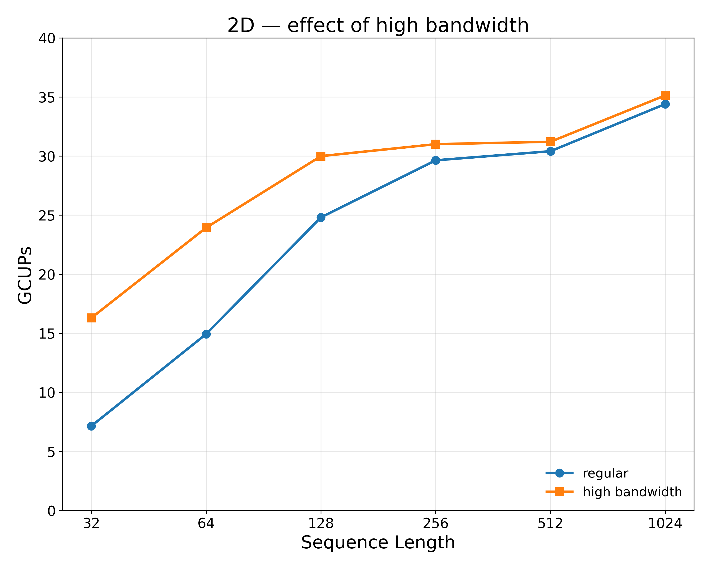

### `1d_effect_hibw.png`

Best-per-CPG slow rows only (the `sw1d_cpg_slow` filter sampled the
largest seq_len per CPG, so this comparison is sparse — 4 points at
the (cpg, seq_len) pairs that have both fast and slow data).  Regular
and high-bandwidth land on top of each other → sw/1d is compute-bound
at every measured configuration.

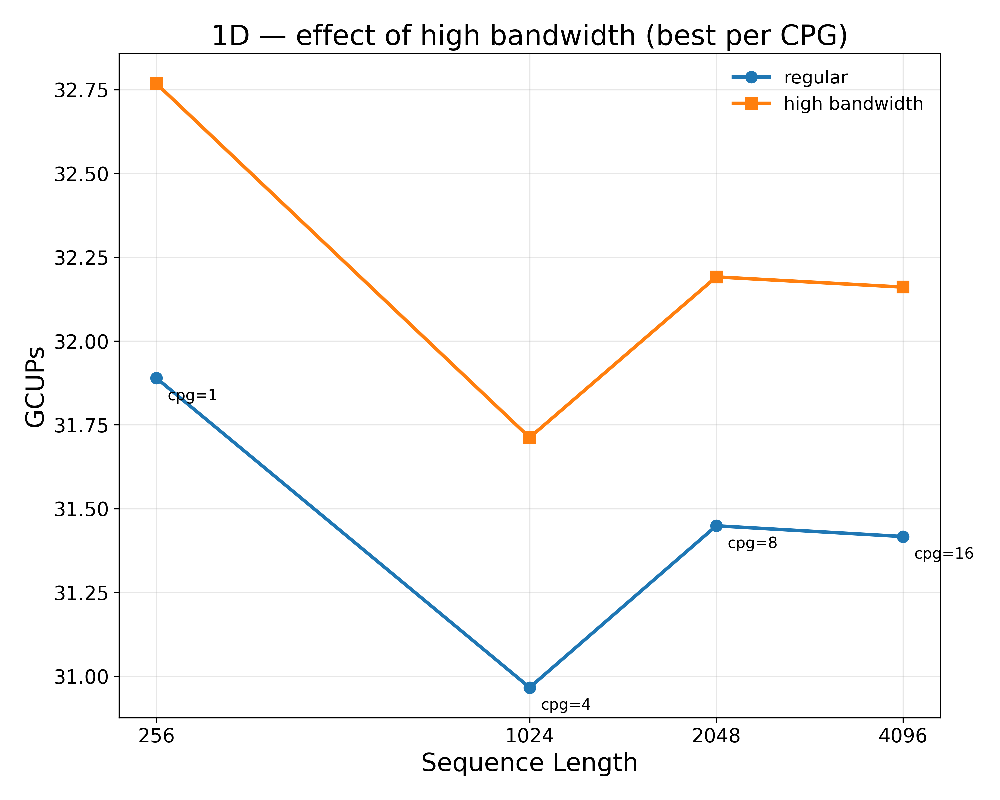

## Area-normalized comparison vs CPU / GPU

GCUPs / mm² across CPU, GPU, and HammerBlade.  HB peak GCUPs is taken
chip-wide (×8) from the best run with cpg > 1 (cpg=1 is the no-grouping
case and unfair to the comparison).  HB die area: 38.875 mm².

| Device   | Process    | Peak GCUPs | Area (mm²) | GCUPs / mm² |
|----------|------------|-----------:|-----------:|------------:|
| CPU (2× Xeon Skylake-SP XCC) | 14 nm    | 734   | 1396  | 0.53 |
| GPU (NVIDIA A100)            | 7 nm     | 1940  | 826   | 2.35 |
| HB (1D, seq_len=2048, cpg=8) | 14/16 nm | 31.45 | 38.88 | 0.81 |
| HB (2D, seq_len=1024)        | 14/16 nm | 34.41 | 38.88 | 0.89 |

### `arch_compare_gcups_per_mm2_wide.png`
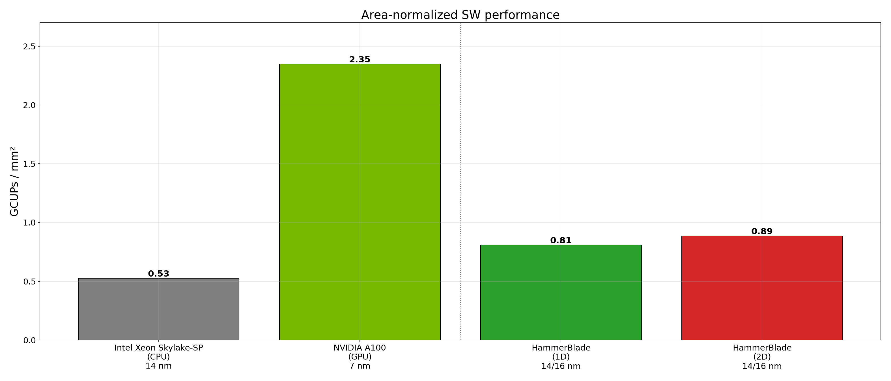
