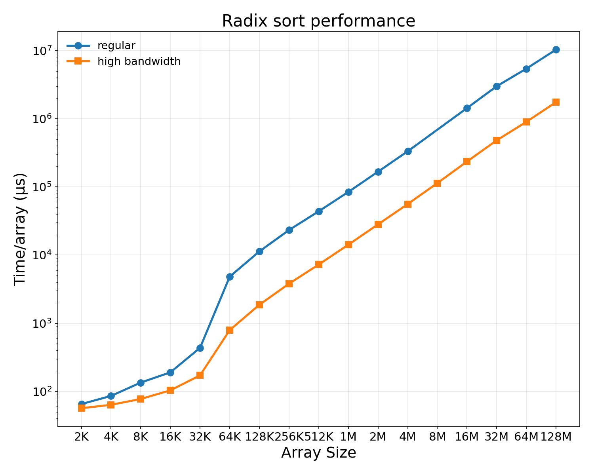
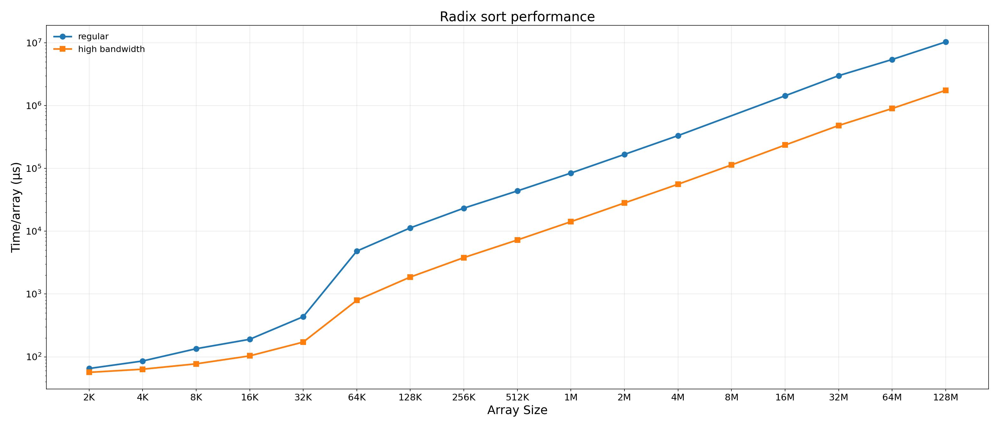
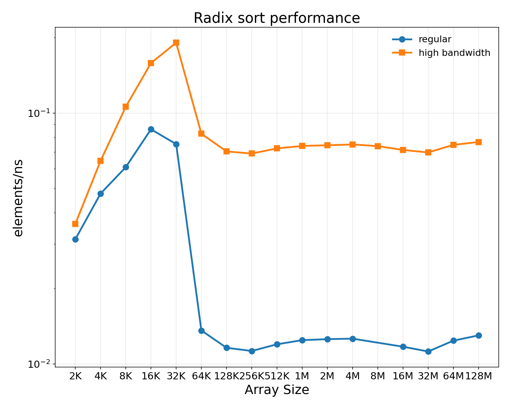
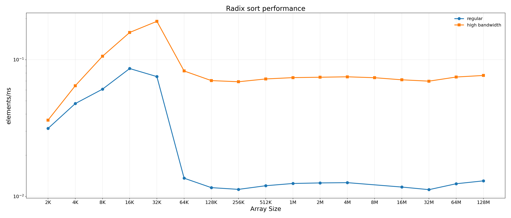
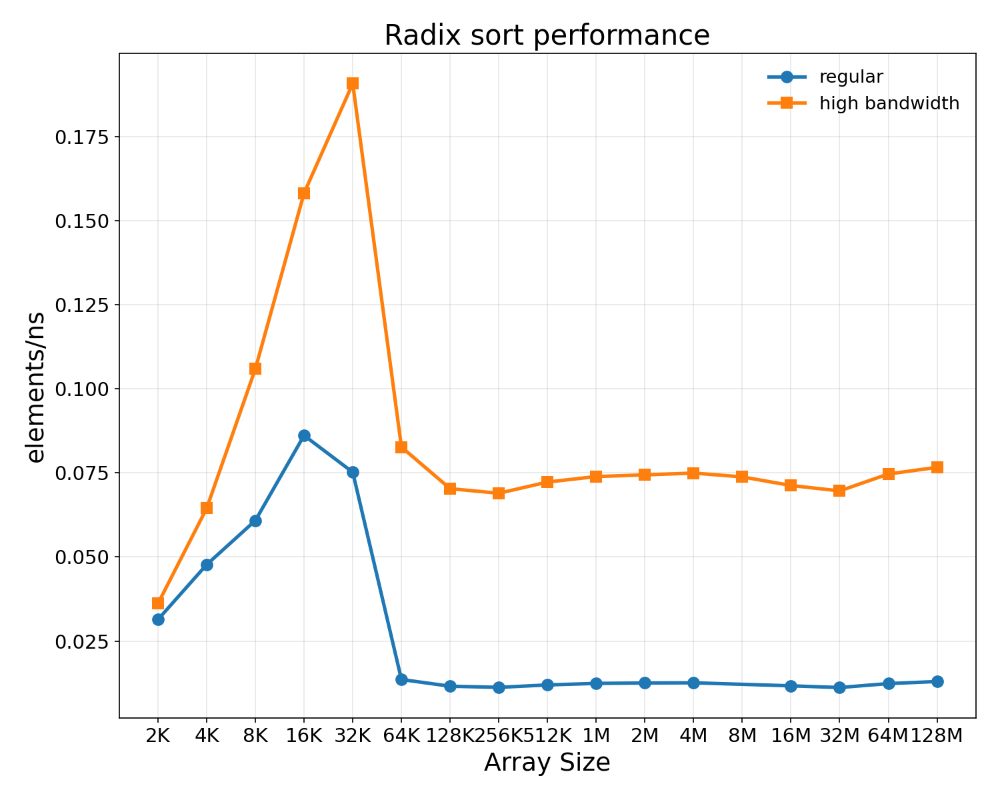
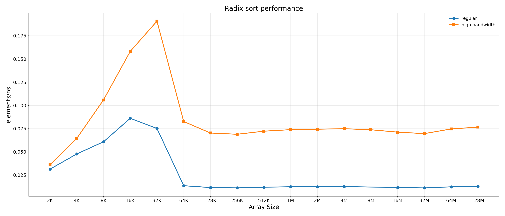

# Sorting (radix sort) charts

Same conventions as `smithwaterman.md`: 10×8 inches default (21×9 wide
variant), 150 dpi.  Array sizes on log base 2 (K = 1024, M = 1024²).

**All numbers are single-pod** — only pod 0 sorts in this kernel
(see `radix_sort/tests.mk` header), so we do *not* multiply by 8.

The slow run scaled `num_arr` by 1/8 (per `run_experiments.sh`); high-
bandwidth values divide raw slow time by 32 (sim32bw projection) and
use the actual num_arr the kernel ran with.

## The vcache cliff at SIZE = 64 K — and how high bandwidth flattens it

Time-per-array (regular) jumps ~6× as soon as a single array overflows
the 128 KB per-pod vcache.  Throughput (elements/ns) shows the same
story inverted: regular peaks at ~0.086 elements/ns at SIZE = 16 K,
collapses to ~0.012 past the cliff.  With high bandwidth, the
post-cliff regime climbs back to **~0.07 elements/ns** — about
**6× higher** than regular post-cliff, basically erasing the cliff.

Pre-cliff, high bandwidth still helps several × — even fully cache-
resident sorts have non-trivial scan/scatter traffic that benefits
from more memory bandwidth.

## Time per array

### `radix_time.png` / `radix_time_wide.png`

## Throughput (elements/ns)

### Log y — `radix_elem_per_ns.png` / `radix_elem_per_ns_wide.png`

### Linear y — `radix_elem_per_ns_linear.png` / `radix_elem_per_ns_linear_wide.png`

