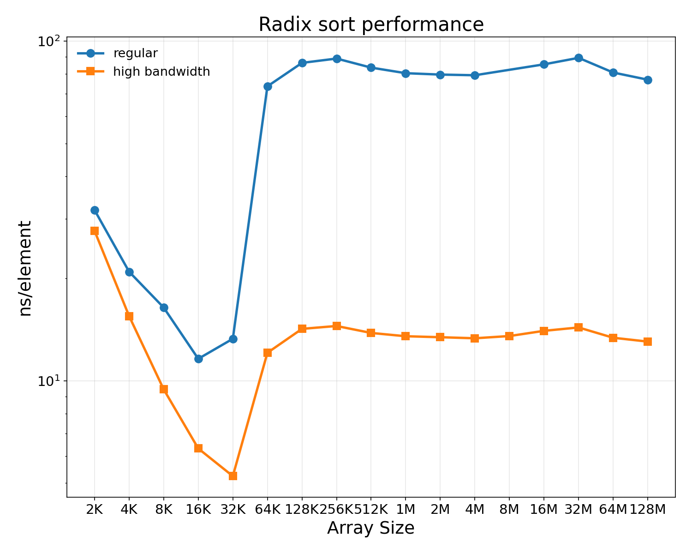
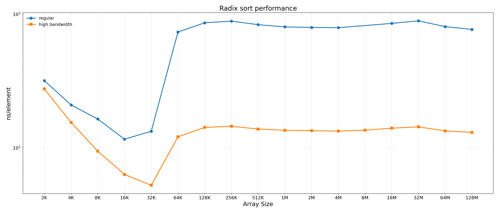

# Sorting (radix sort) charts

Same conventions as `smithwaterman.md`: 10×8 inches default (21×9 wide
variant), 150 dpi.  Sequence-of-array sizes on log base 2 (K = 1024,
M = 1024²).

The kernel sorts `NUM_ARR` distinct `SIZE`-element arrays per call;
each row keeps `NUM_ARR × SIZE ≈ 256 M ints` so total work is held
constant.  Time differences across sizes are entirely **per-element
cost**.

## The vcache cliff at SIZE = 64 K — and how much high bandwidth helps

Per-element cost (regular) stays in the **~10–30 ns** band while each
array fits in the per-pod vcache (SIZE ≤ 32 K ints, 128 KB).  Past that,
the sort spills to DRAM and per-element cost jumps to **~70–80 ns** — a
~6× cliff.  With high bandwidth (slow run × 32 sim32bw), the post-cliff
cost drops back to **~13 ns** — essentially **eliminating the cliff** so
DRAM-resident sorts cost roughly the same per element as in-vcache ones.

Pre-cliff, high bandwidth still helps a few × — even at SIZE ≤ 32 K the
sort isn't perfectly compute-bound (there's some scan / scatter traffic
beyond the active vcache lines, and the slow-mode `num_arr /= 8`
scaling shifts the work-vs-overhead balance).

Both plots: blue = regular, orange = high bandwidth.  The high-bandwidth
raw-time curve is extrapolated to the regular run's nominal work amount
(NUM_ARR × SIZE = 256 M ints) so the two curves are directly comparable.

## Raw kernel time

### `radix_time.png` / `radix_time_wide.png`

## ns per element

### `radix_ns_per_elem.png` / `radix_ns_per_elem_wide.png`

